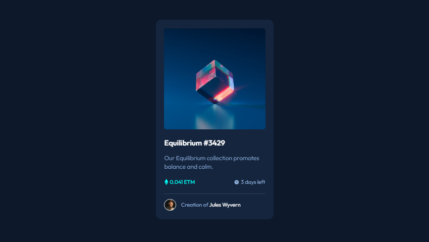
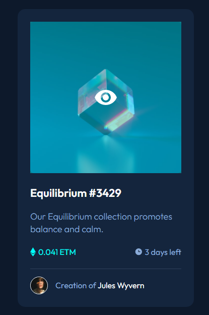

# NFT Card

Trata-se de um layout criativo de um NFT Card, baseado em um desafio do FrontEnd Mentor! 🚀

[](https://google.com)

[](https://google.com)

## Objetivo

O objetivo principal deste projeto é treinar a análise de um design, identificando os possíveis elementos utilizados no HTML e CSS, para só assim codarmos da melhor forma possível!

## O Que é um NFT Card?

O NFT, ou token não-fungível, é um registro digital da posse de determinado bem, seja ele real ou virtual. Token significa criptoativo, um bem digital que só existe dentro de um banco de dados compartilhado.

## Tecnologias Utilizadas
- HTML
- CSS

## Como Utilizar

1 - Clone o projeto
```
git clone <url>
```

2 - Acesse a pasta do projeto

```
cd workshop-nft-card-inicial-main
```